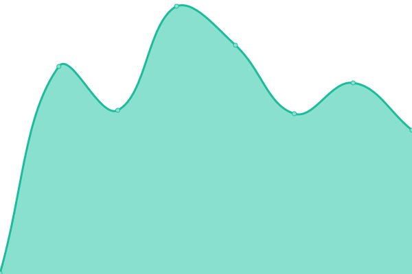

# [📈 Live Status](https://DanielMSchmidt.github.io/uptime): <!--live status--> **🟧 Partial outage**

This repository contains the open-source uptime monitor and status page for [Daniel Schmidt](http://danielmschmidt.de/), powered by [Upptime](https://github.com/upptime/upptime).

With [Upptime](https://upptime.js.org), you can get your own unlimited and free uptime monitor and status page, powered entirely by a GitHub repository. We use [Issues](https://github.com/DanielMSchmidt/uptime/issues) as incident reports, [Actions](https://github.com/DanielMSchmidt/uptime/actions) as uptime monitors, and [Pages](https://DanielMSchmidt.github.io/uptime) for the status page.

<!--start: status pages-->
<!-- This summary is generated by Upptime (https://github.com/upptime/upptime) -->
<!-- Do not edit this manually, your changes will be overwritten -->
<!-- prettier-ignore -->
| URL | Status | History | Response Time | Uptime |
| --- | ------ | ------- | ------------- | ------ |
|  [DanielMSchmidt.de](https://danielmschmidt.de) | 🟩 Up | [daniel-m-schmidt-de.yml](https://github.com/DanielMSchmidt/uptime/commits/HEAD/history/daniel-m-schmidt-de.yml) | 

 224ms
     
 | 

<a href="https://DanielMSchmidt.github.io/uptime/history/daniel-m-schmidt-de">100.00%</a>
    

|  [Daniel-S.de](https://daniel-s.de) | 🟩 Up | [daniel-s-de.yml](https://github.com/DanielMSchmidt/uptime/commits/HEAD/history/daniel-s-de.yml) | 

 1091ms
     
 | 

<a href="https://DanielMSchmidt.github.io/uptime/history/daniel-s-de">100.00%</a>
    

|  [Review-Now.de](https://review-now.de) | 🟥 Down | [review-now-de.yml](https://github.com/DanielMSchmidt/uptime/commits/HEAD/history/review-now-de.yml) | 

 1036ms
     
 | 

<a href="https://DanielMSchmidt.github.io/uptime/history/review-now-de">28.10%</a>
    

|  [cdktf.danielmschmidt.de](http://cdktf.danielmschmidt.de) | 🟩 Up | [cdktf-danielmschmidt-de.yml](https://github.com/DanielMSchmidt/uptime/commits/HEAD/history/cdktf-danielmschmidt-de.yml) | 

 698ms
     
 | 

<a href="https://DanielMSchmidt.github.io/uptime/history/cdktf-danielmschmidt-de">100.00%</a>
    

<!--end: status pages-->

[**Visit our status website →**](https://DanielMSchmidt.github.io/uptime)

## 📄 License

- Powered by: [Upptime](https://github.com/upptime/upptime)
- Code: [MIT](./LICENSE) © [Daniel Schmidt](http://danielmschmidt.de/)
- Data in the `./history` directory: [Open Database License](https://opendatacommons.org/licenses/odbl/1-0/)
